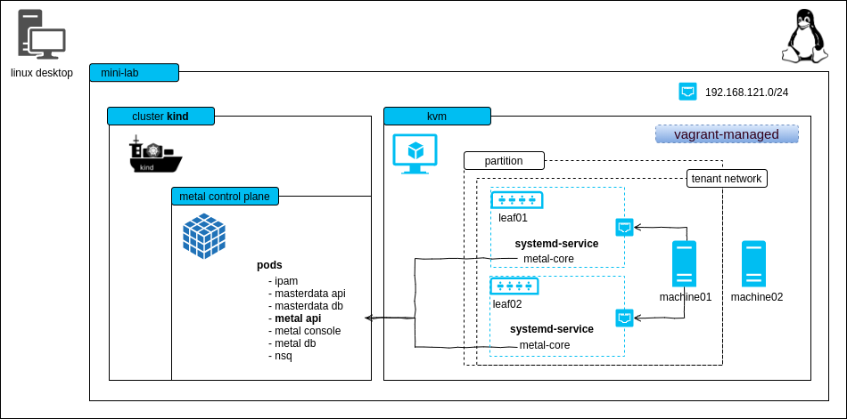
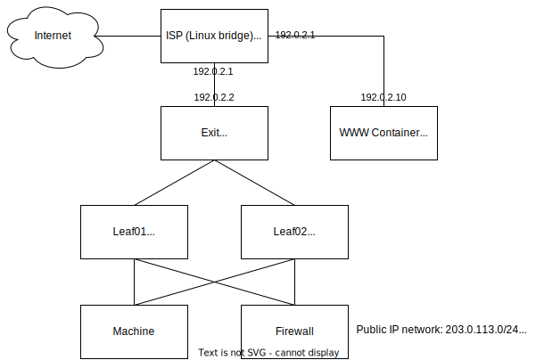

# mini-lab

The mini-lab is a small, virtual setup to locally run the metal-stack. It deploys the metal control plane and a metal-stack partition with two simulated leaf switches. The lab can be used for trying out metal-stack, demonstration purposes or development.



ℹ This project can also be used as a template for writing your own metal-stack deployments.

<!-- TOC depthfrom:2 depthto:6 withlinks:true updateonsave:false orderedlist:false -->

- [Requirements](#requirements)
- [Known Limitations](#known-limitations)
- [Try it out](#try-it-out)
    - [Reinstall machine](#reinstall-machine)
    - [Free machine](#free-machine)
- [Flavors](#flavors)
- [Network Topology](#network-topology)

<!-- /TOC -->

## Requirements

- Linux machine with hardware virtualization support
- kvm as hypervisor for the VMs (you can check through the `kvm-ok` command)
- [docker](https://www.docker.com/) >= 24.x.y (for using kind and our deployment base image)
- [kind](https://github.com/kubernetes-sigs/kind/releases) == v0.23.0 (for hosting the metal control plane)
- [containerlab](https://containerlab.dev/install/) >= v0.56.0
- the lab creates a docker network on your host machine with the address block `203.0.113.0/24`, designated as TEST-NET-3 for documentation and examples.
- (recommended) haveged to have enough random entropy (only needed if the PXE process does not work)

Here is some code that should help you to set up most of the requirements:

 ```bash
# If UFW enabled.
# Disable the firewall or allow traffic through Docker network IP range.
sudo ufw status
sudo ufw allow from 172.17.0.0/16

# Install kvm
sudo apt install -y git curl qemu qemu-kvm haveged

# Install Docker
curl -fsSL https://get.docker.com | sh
# if you want to be on the safe side, follow the original installation
# instructions at https://docs.docker.com/engine/install/ubuntu/

# Ensure that your user is member of the group "docker"
# you need to login again in order to make this change take effect
sudo usermod -G docker -a ${USER}

# Install containerlab
bash -c "$(curl -sL https://get.containerlab.dev)"

# Install kind (kubernetes in docker), for more details see https://kind.sigs.k8s.io/docs/user/quick-start/#installation
sudo curl -Lo /usr/local/bin/kind "https://kind.sigs.k8s.io/dl/v0.20.0/kind-linux-amd64"
sudo chmod +x /usr/local/bin/kind
```

The following ports are used statically on your host machine:

| Port | Bind Address | Description                        |
|:----:|:------------ |:---------------------------------- |
| 6443 |   0.0.0.0    | kube-apiserver of the kind cluster |
| 4443 |   0.0.0.0    | HTTPS ingress                      |
| 4150 |   0.0.0.0    | nsqd                               |
| 8080 |   0.0.0.0    | HTTP ingress                       |

## Known Limitations

- to keep the demo small there is no EVPN
- machine restart and destroy does not work because we cannot change the boot order via IPMI in the lab easily (virtual-bmc could, but it's buggy)
- login to the machines is possible with virsh console, login to the firewall is possible with SSH from your local machine

## Try it out

```bash
git clone https://github.com/metal-stack/mini-lab.git
cd mini-lab
```

Start the mini-lab with a kind cluster, a metal-api instance as well as two containers wrapping leaf switches and another container that hosts two user-allocatable machines:

```bash
make
# containerlab will ask you for root permissions (https://github.com/srl-labs/containerlab/issues/669)
```

After the deployment and waiting for a short amount of time, two machines in status `PXE booting` become visible through `metalctl machine ls`:

```bash
docker compose run --rm metalctl machine ls

ID                                          LAST EVENT   WHEN     AGE  HOSTNAME  PROJECT  SIZE          IMAGE  PARTITION
00000000-0000-0000-0000-000000000001        PXE Booting  3s
00000000-0000-0000-0000-000000000002        PXE Booting  5s
```

Wait until the machines reach the waiting state:

```bash
docker compose run --rm metalctl machine ls

ID                                          LAST EVENT   WHEN     AGE  HOSTNAME  PROJECT  SIZE          IMAGE  PARTITION
00000000-0000-0000-0000-000000000001        Waiting      8s                               v1-small-x86         mini-lab
00000000-0000-0000-0000-000000000002        Waiting      8s                               v1-small-x86         mini-lab
```

Create a firewall and a machine with:

```bash
make firewall
make machine
```

__Alternatively__, you may want to issue the `metalctl` commands on your own:

```bash
docker compose run --rm metalctl network allocate \
        --partition mini-lab \
        --project 00000000-0000-0000-0000-000000000000 \
        --name user-private-network

# lookup the network ID and create a machine
docker compose run --rm metalctl machine create \
        --description test \
        --name machine \
        --hostname machine \
        --project 00000000-0000-0000-0000-000000000000 \
        --partition mini-lab \
        --image ubuntu-20.04 \
        --size v1-small-x86 \
        --networks <network-ID>

# create a firewall that is also connected to the virtual internet-mini-lab network
docker compose run --rm metalctl machine create \
        --description fw \
        --name fw \
        --hostname fw \
        --project 00000000-0000-0000-0000-000000000000 \
        --partition mini-lab \
        --image firewall-ubuntu-2.0 \
        --size v1-small-x86 \
        --networks internet-mini-lab,$(privatenet)
```

See the installation process in action

```bash
make console-machine01/02
...
Ubuntu 20.04 machine ttyS0

machine login:
```

Two machines are now installed and have status "Phoned Home"

```bash
docker compose run --rm metalctl machine ls
ID                                          LAST EVENT   WHEN   AGE     HOSTNAME  PROJECT                               SIZE          IMAGE                             PARTITION
00000000-0000-0000-0000-000000000001        Phoned Home  2s     21s     machine   00000000-0000-0000-0000-000000000000  v1-small-x86  Ubuntu 20.04 20200331             mini-lab
00000000-0000-0000-0000-000000000002        Phoned Home  8s     18s     fw        00000000-0000-0000-0000-000000000000  v1-small-x86  Firewall 2 Ubuntu 20200730        mini-lab
```

Login with user name metal and the console password from

```bash
docker compose run --rm metalctl machine consolepassword 00000000-0000-0000-0000-000000000001
```

To remove the kind cluster, the switches and machines, run:

```bash
make cleanup
```

### Reinstall machine

Reinstall a machine with

```bash
docker compose run --rm metalctl machine reinstall \
        --image ubuntu-20.04 \
        00000000-0000-0000-0000-000000000001
```

### Free machine

Free a machine with `make free-machine01` or

```bash
docker compose run --rm metalctl machine rm 00000000-0000-0000-0000-000000000001
```

## Flavors

There are two versions, or flavors, of the mini-lab environment which differ in regards to the NOS running on the leaves:

- `cumulus` -- runs 2 Cumulus switches.
- `sonic` -- runs 2 SONiC switches

In order to start specific flavor, you can define the flavor as follows:

```bash
export MINI_LAB_FLAVOR=sonic
make
```

## Network topology

An Nginx is running inside of the www container to allow automatic testing of outgoing connections.


